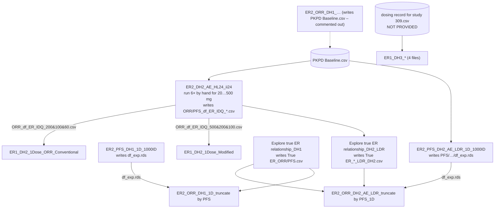

# 1. A tour of the current codebase

## 1.1 The one-paragraph summary

All of this code is a **simulation study about analysis methods**. The authors
build a virtual oncology trial in which they control the truth: either the
drug has **no effect** on the outcome (scenario **ER1**) or the outcome is
**driven by drug exposure** through a tumour-size model (scenario **ER2**).
They then run the analyses a pharmacometrician would normally run on a
pivotal trial: logistic regression of ORR on exposure, Kaplan–Meier by
exposure quantile, and univariate Cox models. Comparing those results with
the known truth shows when *time-dependent exposure metrics* (CavgTE, the
average concentration up to the event or censoring) produce false or
distorted E–R slopes. The distortion comes from accumulation, dose
modifications and how early events occur.

Every script is a variation on one pipeline:

```mermaid
flowchart LR
  A[Individual PK parameters<br/>CSV, bootstrapped to N subjects] --> B
  P[PK scenario<br/>Case.fix = PK1/PK2/PK3<br/>scales KA, CL, V] --> B
  D[Dosing history<br/>DH1 fixed / DH2 AE-driven / DH3 empirical] --> B
  B[mrgsolve simulation<br/>hourly grid, 600 days] --> C[Exposure metrics per day<br/>Cmax, Ctrough, Cavg, Cavg1W/2W/4W,<br/>CavgTE, cycle-1, steady-state]
  B --> T[Tumour size T&#40;t&#41;<br/>ER2 only]
  W[Weibull event times + random censoring<br/>ER1 only, independent of drug] --> M
  T --> E[ORR: T &lt; 0.7·T0<br/>PFS: T ≥ 1.2·T0] --> M
  C --> M[Merge exposure with outcome:<br/>truncate each subject at event/censor day]
  M --> R[Conventional E–R analyses<br/>glm logistic, Emax &#40;brms&#41;, KM by quantile, Cox]
  R --> L[Replicate loop<br/>500–1000 seeds → Type I error, OR bias]
```

## 1.2 Vocabulary

The file names encode the scenario. Once you can read them, the repository
becomes navigable.

| Token | Meaning | Where it lives in code |
|-------|---------|------------------------|
| **ER1** | Outcome independent of exposure. Event times drawn from a Weibull; any E–R slope found is false. | `rweibull(...)` in the "TTE dataset" chunk |
| **ER2** | Outcome caused by exposure via the tumour model (sigmoid Emax on tumour decay rate) | `PKPD_tumor_*.mod` |
| **DH1** | Constant dosing, no modifications | `ev(amt=..., ii=24, addl=599)` |
| **DH2** | Dynamic dosing: concentration drives an AE probability, and an AE triggers a 7-day interruption followed by a step down DOSEI→DOSEII→DOSEIII | `PKPD_tumor_DH2_AE_LDR.mod` (`$ERROR` block, `evtools` regimen) |
| **DH3** | Empirical dosing: real dose records bootstrapped from a clinical study | `dosing record for study 309.csv` (**not in repo**) |
| **EO1 / EO2** | Event onset fast (Weibull scale ≈ 110 d) or slow (≈ 240 d) | `event.shape`, `event.scale` |
| **PK1/PK2/PK3** = `Case.fix` 1/2/3 | Time to steady state about 2 days, 5 days or 10 weeks, obtained by rescaling KA, CL, V2, V3, Q of a cabozantinib-like 2-compartment model | `if (Case.fix == ...)` block |
| **HL24, HL7, HL2W** | Half-life label used in output folder names (24 h, 7 d, 2 w) | folder strings only |
| **ii24, ii2W** | Dosing interval 24 h or 2 weeks | `DI` |
| **1D / 2D / 1Dose / 2Dose** | One dose arm or two dose arms | dose vectors `HDOSE/MDOSE/LDOSE` |
| **LDR** | "Lower dose reduction", the stepped-down DH2 schedule | model name |
| **1000ID / 500ID for each arm** | Sample size | `ID.bootstrap`, idata |
| **…OED**, **…1D**, **…C1**, **…SS**, **…TE** | Exposure at the outcome-event day, day 1, cycle 1, steady state, and time-to-event average | `df.ER.IDQ` columns |
| **IDQ** | One row per ID with exposure quantiles (the analysis dataset) | `df.ER.IDQ` |
| **mCavgTE / "Modified"** | The paper's mitigation: for non-responders, truncate the averaging window at the last plausible ORR onset day instead of the last assessment | `*_Modified.Rmd` |

## 1.3 The models (`.mod` files, mrgsolve)

| File | Content | Used by |
|------|---------|---------|
| `KP_2com.mod` | Two-compartment PK with first-order absorption. `CP = CENT/(V2/1000)` (ng/mL), `AUC` compartment integrates CP | All ER1 scripts |
| `PD_tumor_Linear.mod` | Untreated tumour: `dT/dt = Kgrow − Kdecay·T`, with between-subject variability (BSV) on T0, Kgrow, Kdecay | ER2: generates the "natural growth" baseline population |
| `PKPD_tumor_1DOSEL.mod` | PK + tumour; drug multiplies Kdecay by `1 + INH·exp(−Ktol·t)` with `INH = Emax·CPⁿ/(CPⁿ+EC50ⁿ)` (Ktol = tolerance/resistance) | ER2 DH1 scripts |
| `PKPD_tumor_DH2_AE_LDR.mod` | Same, plus a logistic AE model on CP and a dose-modification state machine run through `evtools` | ER2 DH2 and ER1 DH2 scripts |
| inside `True ER relationship.zip` | `PKPD_tumor_fixed_PD.mod`, `PKPD_tumor_no_omega.mod`, `PKPD_tumor_onlyPD_havingW.mod`, `PD_tumor_no_omega.mod` | the "true ER" scripts |

Data inputs:

* `estimated individual PK parameters.csv` has 452 real-looking subjects
  (KA, CL, V2, Q, V3, TR, plus covariates AGE, SEXN, WEIGHT, …). They are
  resampled with replacement to 1000 virtual subjects.
* `PKPD Baseline.csv` has 1000 subjects with tumour parameters (TumorB,
  Kgrow, Kdecay, emax, ec50, ktol) and PK parameters. This file is the
  saved output of the ER2 DH1 script and is reused by DH2 so that both
  share the same virtual patients.
* `PKPD Baseline_control.csv` is identical except emax = 0, giving the
  placebo arm.

## 1.4 How a typical script is built

Each `.Rmd` is a long notebook, 300 to 2600 lines, with the same sections.
Using `ER2_PFS_DH2_AE_LDR_1D_1000ID.Rmd` as an example:

1. **Setup.** `rm(list=ls())`, about 15 `library()` calls, and on Windows
   an Rtools PATH hack.
2. **Common functions** (about 300 lines). Plotting helpers (`KM_plot`,
   `KM_plot_Q`, `Typical_plot_DH2`, `Tumor_Dose_plot`), quantile cutters
   (`quantiles`, `tertile`), result extractors (`univ_con`, `univ_cat`,
   `logistic_analysis`) and an EC50 delta-method helper. **These are
   copy-pasted into every file with small differences between copies.**
3. **Natural tumour growth.** Simulate `PD_tumor_Linear.mod` and derive
   untreated ORR/PFS for reference.
4. **PKPD simulation.** `mrgsim()` on an **hourly grid over 600 days**
   (14.4 M rows for 1000 subjects).
5. **Exposure metrics.** CavgTE = AUC(t)/t, then daily AUC, rolling
   1/2/3/4-week Cavg (`zoo::rollsum`), cycle-1 values, Cmax, Ctrough, and
   cumulative/average dose. The result is saved as `df_exp.rds`.
6. **Endpoints.** PFS = first day with T ≥ 1.2·T0. ORR = first day with
   T < 0.7·T0, with follow-up truncated at PFS. A per-ID `for` loop cuts
   each subject's exposure record at that day.
7. **Analysis dataset `df.ER.IDQ`.** One row per subject with every
   exposure metric and its quartile/tertile.
8. **Conventional E–R analyses.** KM by exposure quantile, univariate Cox
   on each metric, `glm(EVENT ~ metric, binomial)`, and Emax logistic via
   `brms`. Results go to `.xlsx` and `.tiff`.
9. **Replicates.** A `loop()` function regenerates the outcome with a new
   seed (ER1) or resamples, then collects p-values over 500 to 1000 seeds
   to give Type I error and odds-ratio distributions.

## 1.5 How the files depend on each other

The scripts are **not independent**. Several read intermediate files that
another script wrote to the author's OneDrive:

The ER1 DH1 files are the most self-contained. Apart from `setwd()` they
need only `KP_2com.mod` and the PK parameter CSV, so they are the right
place to start reading.

## 1.6 How the "true E–R relationship" is constructed

This matters for the causal work in note 3.

* **DH1 truth** (`Explore true ER relationship_DH1.Rmd`). PK is fixed at
  typical values, so every subject receiving dose *d* has the same exposure
  *c(d)*. PD variability is kept. The model is simulated at 14 dose levels
  (0 to 1000 mg), and the response rate at each dose is plotted against
  *c(d)*. In causal language this is
  **E[Y(c)] = the outcome rate if everyone's exposure were set to c**,
  which is a well-defined interventional dose–response curve. It is
  identified because PK and PD parameters are independent in the
  simulation.
* **DH2 truth** (`Explore true ER relationship_DH2_LDR.Rmd`). The response
  rate in each *starting-dose arm* is plotted against the *median* realised
  exposure in that arm. This is a **different estimand**: the effect of a
  dosing *policy* (start at d, reduce on AE). Placing it on the same
  exposure axis as the DH1 curve mixes two questions.

So the paper already contains a causal estimand, but it is never named as
one, and the two "truths" are not the same quantity. Note 3 builds on this
point.
