# 3. From heuristics to causal inference: a roadmap

## 3.1 What is really going wrong in conventional E–R?

The paper calls the mechanisms "time-dependent confounding factors". Drawn
as a causal graph (DAG), they turn out to be **three different problems**,
and each one has a different remedy.

```mermaid
flowchart LR
  X0[Baseline prognosis<br/>tumour burden, ECOG, albumin] --> CL[Clearance CL]
  X0 --> Y
  D[Assigned dose / regimen<br/>RANDOMISED] --> C1[Exposure, cycle 1]
  CL --> C1
  C1 --> TS1[Tumour size t1]
  C1 --> AE1[AE t1]
  AE1 --> Dmod[Dose modification]
  TS1 --> Dmod
  Dmod --> C2[Exposure later cycles]
  TS1 --> C2
  C2 --> TS2[Tumour size t2]
  TS1 --> TS2
  TS2 --> Y[Outcome: response / progression]
  Y --> FU[Follow-up length]
  FU --> CTE[CavgTE = AUC&#40;0..T_event&#41; / T_event]
  C1 --> CTE
  C2 --> CTE
  classDef bad fill:#fde2e1,stroke:#c0392b;
  class CTE bad;
```

| Mechanism in the paper | Causal name | Why the regression is biased | Principled remedy |
|---|---|---|---|
| CavgTE under accumulation (ER1 inverse slope) | **Reverse causation / outcome-dependent exposure definition.** The "exposure" is computed over a window whose length *is* the outcome time. | Early events → short window → low average (before steady state). The arrow runs Y → CTE. | Never use an exposure defined over an outcome-dependent window. Define exposure on a **fixed, pre-outcome window** (landmark), or model exposure as a **time-varying treatment**. |
| Dose modifications (DH2/DH3 positive slope) | **Time-varying treatment with treatment–confounder feedback.** Later exposure depends on earlier AEs and tumour response, which are themselves affected by earlier exposure. | Conditioning on, or averaging over, post-baseline exposure mixes the treatment with its consequences. Standard regression cannot adjust for a confounder that is also a mediator. | **g-methods**: parametric g-formula, marginal structural models with IPW, or longitudinal TMLE / modified treatment policies (LMTP). |
| CL correlated with disease (nivolumab, pembrolizumab) | **Classic baseline confounding** of exposure → outcome | Sicker patients clear faster *and* do worse. | Adjust for baseline covariates (g-computation, IPW with a generalised propensity score, doubly robust). *Absent from the current simulation.* |

Two points I want you to take from this table.

* **Dose is randomised, exposure is not.** Everything you can learn about
  exposure without assumptions goes *through* dose. Exposure-level claims
  always need extra assumptions: no unmeasured confounding of CL and
  outcome, positivity across the exposure range, and a well-defined
  intervention on exposure.
* **The paper's mitigations are partial fixes for problems this framing
  makes explicit.** "Use static Cavg1C" is the landmark fix. "Add a
  placebo arm or more doses" is the positivity fix. "Use Emax" is a
  model-specification fix. "mCavgTE" shortens the reverse-causation window
  but does not remove it.

## 3.2 Choosing estimands (ICH E9(R1) attributes)

A causal analysis starts by saying precisely *what* we want to know. Below
are the three estimands I would carry through the project. **Estimand A is
the primary one**: it answers a real Project Optimus question.

### Estimand A: dose-optimisation (randomised comparison of regimens)

> *Among patients like those in the trial, what is the difference in
> objective response by week 24 between starting at 100 mg QD and starting
> at 200 mg QD, each with protocol-specified AE-driven
> interruptions/reductions?*

| Attribute | Specification |
|---|---|
| Population | Adult patients with the target tumour, eligible for the study (the virtual population) |
| Treatment | Starting dose *d* ∈ {100, 200} mg QD **including** the protocol dose-modification algorithm (the DH2 rule) |
| Variable | Objective response (≥ 30 % shrinkage, RECIST-like) at any scheduled assessment up to week 24 |
| Intercurrent events | Dose interruption/reduction: **treatment policy** (it is part of the regimen). Discontinuation due to toxicity: treatment policy. Progression before response: **composite** (counted as non-response). Death: composite |
| Summary | Risk difference E[Y(200)] − E[Y(100)], also the ratio. A secondary version uses PFS with RMST difference at 18 months |

This estimand is identified by randomisation alone. Our job is to estimate
it **efficiently**: covariate adjustment, and *borrowing strength through
the E–R model* when arms are small. That borrowing is the honest role of
E–R in dose selection.

### Estimand B: exposure intervention (modified treatment policy)

> *What would the week-24 response rate be if every patient's cycle-1 Cavg
> were 30 % higher than it actually was?* (For example, by dosing to a
> target exposure, or a dose increase in low-exposure patients.)

| Attribute | Specification |
|---|---|
| Treatment | Hypothetical shift policy *c → 1.3·c* on cycle-1 exposure, with subsequent dosing following the protocol |
| Intercurrent events | As in A, with the hypothetical strategy for the exposure shift itself |
| Summary | E[Y(1.3·C1)] − E[Y] |

Why a *shift* rather than "set everyone to c"? A shift stays inside the
observed exposure range, so positivity is much weaker. It also maps to an
actionable decision (raise the dose) and is estimable with LMTP. The
paper's "true ER curve" is the static version, E[Y(c)] for all c. That
curve is nice to plot but needs strong positivity, and in a single-dose
trial the data barely support it, which is the paper's own conclusion
about narrow exposure ranges.

### Estimand C: the static exposure-response curve (for comparison with the paper)

> E[Y(c)] as a function of c, where c is a *fixed* (landmark) cycle-1
> exposure.

We keep this one mainly to show that the paper's DH1 "true ER" is exactly
this estimand, and to compare naive logistic(CavgTE), logistic(Cavg1C) and
causal estimators against it.

## 3.3 Where the truth comes from: simulation as a counterfactual machine

The main methodological advantage of a simulation study is that we can
compute **the true value of each estimand** exactly, by running the
data-generating model under the intervention with the **same virtual
patients and the same random numbers**:

| Estimand | How to compute the truth with mrgsolve |
|---|---|
| A | Simulate the same N patients twice, once with `start_dose = 100` and once with `200`. The AE/dose-modification process runs as in the protocol. Compare mean outcomes. Use large N (≥ 20,000) for Monte Carlo precision |
| B | For each patient, multiply the cycle-1 dose by the factor needed to raise C1 by 30 % (linear PK: dose × 1.3), keep everything else, and simulate |
| C | Fix each patient's exposure trajectory to the target c (for example via an infusion with rate CL·c, or by scaling dose by c/C1ᵢ), and simulate on a grid of c |

This replaces the hand-assembled "True ER" CSVs with a single function,
`truth(scenario, estimand)`. It also removes the DH1/DH2 truth mismatch
noted in note 1 §1.6.

## 3.4 Data-generating model: what to add to make causal methods earn their keep

The current simulator isolates time-dependent problems by design. To create
a meaningful test bed, add switchable mechanisms:

1. **Baseline confounder X₀** (for example log tumour burden or an albumin
   surrogate) that raises CL (Cov(η_CL, X₀) > 0) *and* raises Kgrow. This
   reproduces the nivolumab-type confounding. Strength parameter `rho_conf`.
2. **AE risk depending on tumour state and on CP.** The AE probability gets
   a term in tumour size or performance status, so dose modifications are
   driven by prognosis as well as exposure. This gives true
   treatment–confounder feedback.
3. **Informative dropout.** The hazard of discontinuation rises with tumour
   growth.
4. **Assessment schedule.** Tumour scans every 8 weeks, RECIST nadir-based
   PFS and confirmed ORR.
5. **Two or more randomised dose arms**, so that estimand A exists.

Each switch is a YAML knob (note 2 §2.4), and a "paper-compatible" scenario
simply turns them all off.

## 3.5 Estimators to compare (all in R)

| Family | Method | R tooling | Targets |
|---|---|---|---|
| Conventional (baseline) | logistic / Emax on CavgTE, Cavg1C; KM by quartile; Cox | `glm`, `survival`, `brms` | (none formally) |
| Randomisation-based | Unadjusted and covariate-adjusted risk difference between dose arms (standardisation) | `glm` + `marginaleffects::avg_comparisons()` | A |
| Pharmacometric g-formula | Fit a joint PK–TGI–AE–dropout model with **nlmixr2** to the simulated trial, then **simulate the counterfactual regimens with mrgsolve** using the fitted parameters and uncertainty | `nlmixr2`, `mrgsolve` | A, B, C |
| Statistical g-formula | Sequential outcome / covariate models over visits, Monte Carlo under the intervention | `gfoRmula` | A, B |
| IPW / MSM | Generalised propensity score for continuous C1 given X₀; time-varying weights for dose modification | `WeightIt`, `survival` (weighted Cox / KM), `marginaleffects` | B, C |
| Doubly robust, time-varying | Longitudinal modified treatment policies (shift interventions), with survival outcomes supported | `lmtp` (TMLE / SDR, SuperLearner) | B (and A as a static policy) |

The middle rows contain a **key insight for a pharmacometrician**: a
mechanistic PK–PD model fitted with nlmixr2 and then simulated under a new
regimen in mrgsolve *is* the parametric g-formula. The causal assumptions
are the same ones (correct structural model, no unmeasured confounding of
the individual random effects, sequential exchangeability). The causal
inference vocabulary tells you which assumptions you are relying on when
you trust a model-based dose recommendation. The non-parametric estimators
(LMTP, IPW) are the robustness check that does not depend on the PK–PD
model being right.

## 3.6 The worked use case we will build

**Question.** A drug was studied at 200 mg QD (pivotal) with a small 100 mg
cohort. About 50 % of patients at 200 mg needed reductions. Would 100 mg
give materially lower ORR? And would a higher exposure in low-exposure
patients improve response?

**Plan.**

1. Simulate the trial: 2 arms (200 mg n = 300, 100 mg n = 100), DH2 rule,
   8-weekly scans, X₀ confounding on.
2. Truth: compute estimands A and B by counterfactual simulation (§3.3).
3. Analyse each simulated trial with every estimator in §3.5.
4. Replicate R = 200–500 times and report **bias, empirical SE, coverage
   and power** for each estimand × estimator, using the ADEMP framework
   (Morris, White & Crowther 2019, *Stat Med*) to structure the simulation
   study.
5. Show the conventional logistic(CavgTE) slope alongside, as the "what a
   standard ER report would have said" comparison.

**What I expect to see, as hypotheses to test:**

* Naive CavgTE is biased toward a steeper positive slope under DH2. We
  should reproduce the paper's result.
* Cavg1C is unbiased for C *only* when `rho_conf = 0`, and biased once
  baseline confounding is switched on.
* Adjusted estimators (g-computation, LMTP) recover A and B under
  measured confounding, and fail in an understandable way under
  unmeasured confounding. This motivates a **sensitivity analysis**
  (E-values, or a bias parameter on the CL–prognosis correlation).
* The nlmixr2 + mrgsolve g-formula is the most efficient when the
  structural model is right, and biased when it is misspecified. A
  deliberate misspecification scenario (for example fitting linear
  instead of Emax drug effect) demonstrates the trade-off.

## 3.7 Honest caveats

* **Positivity is the binding constraint** in single-dose trials. No
  method creates information about exposures nobody had. Causal methods
  make this visible (extreme weights, wide intervals); heuristics hide it.
* **Exposure is not directly manipulable.** "Setting Cavg to c" is a
  hypothetical whose meaning depends on *how* it is achieved (dose, or
  inhibiting CL?). Shift policies tied to a dose change are the most
  defensible.
* **Simulation results cannot be more realistic than the data-generating
  model.** That is why §3.4 matters: it lets us test robustness to the
  mechanisms real data have.

## Further reading

* Hernán & Robins, *Causal Inference: What If* (free online), chapters
  19–21 on time-varying treatments and the g-formula.
* ICH E9(R1) Addendum on Estimands (2019).
* Díaz et al. (2023) "Nonparametric causal effects based on longitudinal
  modified treatment policies", *JASA*, and the `lmtp` package vignettes.
* Wiens, French & Rogers (2024) "Confounded exposure metrics", *CPT:PSP*
  13:187 (ref. 7 of the paper).
* Morris, White & Crowther (2019) "Using simulation studies to evaluate
  statistical methods", *Stat Med* 38:2074.
